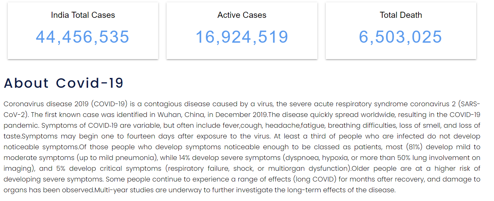
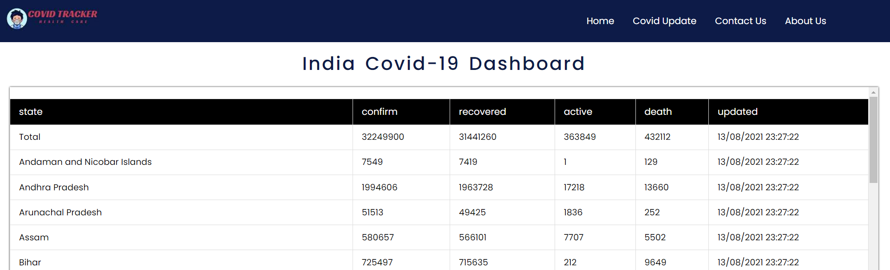

# CovidTracker
### 

 

|  |  |  |

|  | 
 

 ## Features
 - [x] Registering Users
 - [x] Add tasks
 - [x] Three task status (to do, doing, done)
 - [x] Set time and date
 - [x] Set image for task (camera)
 - [x] Admin user
 - [x] Default images for non picture tasks
 - [x] Edit and delete tasks
 - [x] Search tasks
 ## External Libraries
 - Material
 - GreenDAO

 
