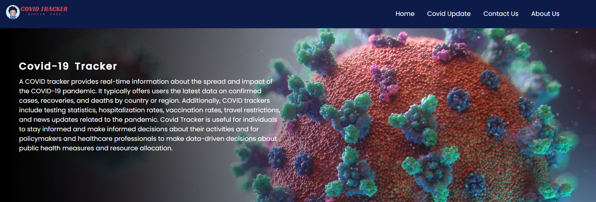

# CovidTracker

This website is designed to help users track the latest COVID-19 statistics in real-time. 
It fetches data through an API, which is updated frequently with the latest information.

Features 
Display of global COVID-19 statistics, such as the total number of confirmed cases, active, deaths, updated and recoveries. 
Search functionality to find specific State and their COVID-19 statistics. 
Data visualization of COVID-19 trends and patterns over time. 

 
 
 
 
 
 

 
